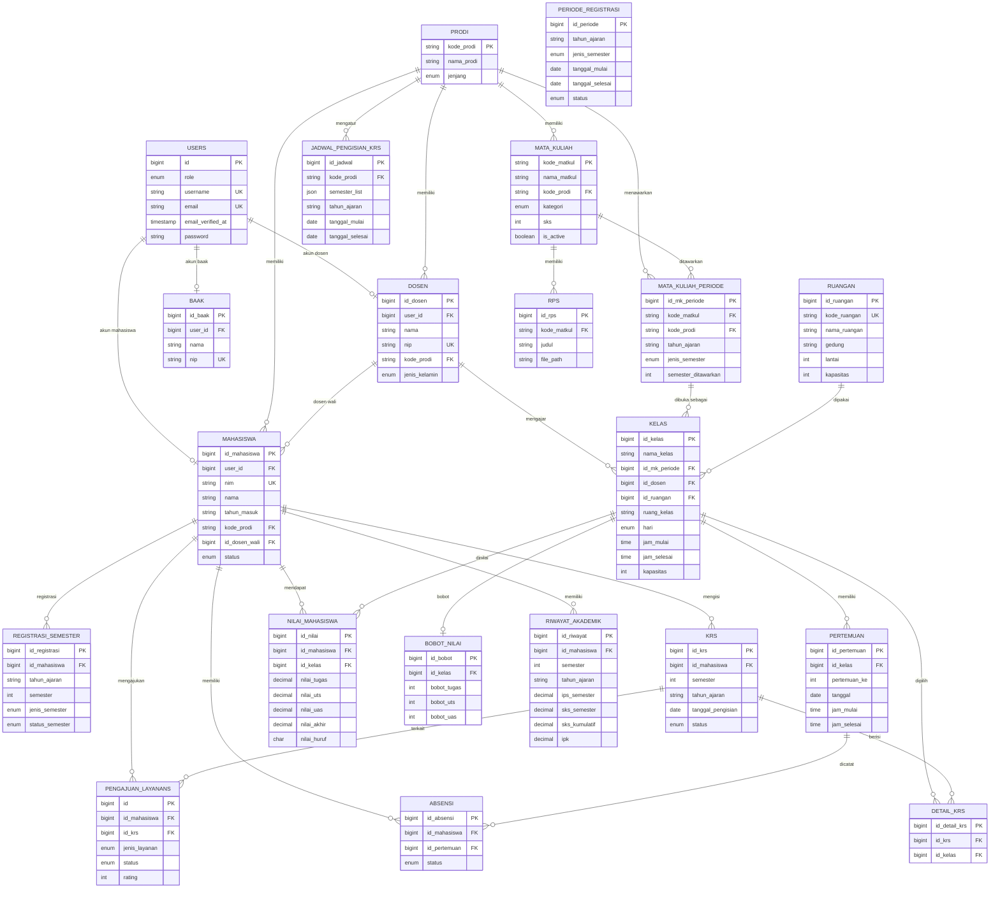

# ERD Sistem Akademik

Dokumen ini dibuat berdasarkan migration dan model Laravel pada proyek. Tabel bawaan/infrastruktur Laravel yang tidak dimasukkan: `cache`, `cache_locks`, `jobs`, `job_batches`, `failed_jobs`, `sessions`, dan `password_reset_tokens`.

`users` tetap dimasukkan karena menjadi tabel akun utama untuk role `mahasiswa`, `dosen`, dan `baak`.

## Daftar Tabel

| No | Tabel | Primary Key | Foreign Key | Keterangan |
|---:|---|---|---|---|
| 1 | `users` | `id` | - | Akun login pengguna aplikasi. |
| 2 | `prodi` | `kode_prodi` | - | Data program studi. |
| 3 | `dosen` | `id_dosen` | `user_id`, `kode_prodi` | Data dosen dan akun dosen. |
| 4 | `baak` | `id_baak` | `user_id` | Data petugas BAAK dan akun BAAK. |
| 5 | `mahasiswa` | `id_mahasiswa` | `user_id`, `kode_prodi`, `id_dosen_wali` | Data mahasiswa, prodi, dan dosen wali. |
| 6 | `periode_registrasi` | `id_periode` | - | Periode registrasi akademik. |
| 7 | `registrasi_semester` | `id_registrasi` | `id_mahasiswa` | Registrasi semester mahasiswa. |
| 8 | `mata_kuliah` | `kode_matkul` | `kode_prodi` | Master mata kuliah. |
| 9 | `mata_kuliah_periode` | `id_mk_periode` | `kode_matkul`, `kode_prodi` | Mata kuliah yang ditawarkan per tahun ajaran/semester. |
| 10 | `ruangan` | `id_ruangan` | - | Master ruangan kelas. |
| 11 | `kelas` | `id_kelas` | `id_mk_periode`, `id_dosen`, `id_ruangan` | Kelas per mata kuliah periode, dosen, jadwal, dan ruangan. |
| 12 | `jadwal_pengisian_krs` | `id_jadwal` | `kode_prodi` | Jadwal pengisian KRS per prodi. |
| 13 | `krs` | `id_krs` | `id_mahasiswa` | Header KRS mahasiswa. |
| 14 | `detail_krs` | `id_detail_krs` | `id_krs`, `id_kelas` | Detail kelas yang diambil pada KRS. |
| 15 | `pertemuan` | `id_pertemuan` | `id_kelas` | Jadwal/pertemuan kuliah. |
| 16 | `absensi` | `id_absensi` | `id_mahasiswa`, `id_pertemuan` | Kehadiran mahasiswa pada pertemuan. |
| 17 | `nilai_mahasiswa` | `id_nilai` | `id_mahasiswa`, `id_kelas` | Nilai mahasiswa pada kelas. |
| 18 | `bobot_nilai` | `id_bobot` | `id_kelas` | Komposisi bobot penilaian kelas. |
| 19 | `rps` | `id_rps` | `kode_matkul` | Rencana pembelajaran semester mata kuliah. |
| 20 | `riwayat_akademik` | `id_riwayat` | `id_mahasiswa` | Rekap IPS, SKS, dan IPK mahasiswa. |
| 21 | `pengajuan_layanans` | `id` | `id_mahasiswa`, `id_krs` | Pengajuan layanan cetak KRS/KHS/transkrip. |

## Data Dictionary Ringkas

| Tabel | Atribut Utama |
|---|---|
| `users` | `id` PK, `role`, `username` unique, `email` unique, `email_verified_at`, `password`, `remember_token`, `created_at`, `updated_at` |
| `prodi` | `kode_prodi` PK, `nama_prodi`, `jenjang`, `created_at`, `updated_at` |
| `dosen` | `id_dosen` PK, `user_id` FK, `nama`, `nip` unique, `kode_prodi` FK, `jenis_kelamin`, `alamat`, `no_hp`, `foto`, `created_at`, `updated_at` |
| `baak` | `id_baak` PK, `user_id` FK, `nama`, `nip` unique, `no_hp`, `created_at`, `updated_at` |
| `mahasiswa` | `id_mahasiswa` PK, `user_id` FK, `nim` unique nullable, `nama`, `tahun_masuk`, `kode_prodi` FK, `id_dosen_wali` FK nullable, `tanggal_lahir` nullable, `jenis_kelamin` nullable, `agama`, `alamat`, `no_hp`, `nama_ayah`, `nama_ibu`, `no_telp_ayah`, `no_telp_ibu`, `status`, `foto`, `created_at`, `updated_at` |
| `periode_registrasi` | `id_periode` PK, `tahun_ajaran`, `jenis_semester`, `tanggal_mulai`, `tanggal_selesai`, `status`, `created_at`, `updated_at` |
| `registrasi_semester` | `id_registrasi` PK, `id_mahasiswa` FK, `tahun_ajaran`, `semester`, `jenis_semester`, `status_semester`, `tanggal_registrasi`, `keterangan`, `created_at`, `updated_at` |
| `mata_kuliah` | `kode_matkul` PK, `nama_matkul`, `kode_prodi` FK nullable, `kategori`, `sks`, `is_active`, `deskripsi`, `created_at`, `updated_at` |
| `mata_kuliah_periode` | `id_mk_periode` PK, `kode_matkul` FK, `kode_prodi` FK, `tahun_ajaran`, `jenis_semester`, `semester_ditawarkan`, `catatan`, `created_at`, `updated_at` |
| `ruangan` | `id_ruangan` PK, `kode_ruangan` unique, `nama_ruangan`, `gedung`, `lantai`, `kapasitas`, `keterangan`, `is_active`, `created_at`, `updated_at` |
| `kelas` | `id_kelas` PK, `nama_kelas`, `id_mk_periode` FK, `id_dosen` FK, `id_ruangan` FK nullable, `ruang_kelas`, `hari`, `jam_mulai`, `jam_selesai`, `kapasitas`, `created_at`, `updated_at` |
| `jadwal_pengisian_krs` | `id_jadwal` PK, `kode_prodi` FK, `semester_list`, `tahun_ajaran`, `tanggal_mulai`, `tanggal_selesai`, `created_at`, `updated_at` |
| `krs` | `id_krs` PK, `id_mahasiswa` FK, `semester`, `tahun_ajaran`, `tanggal_pengisian`, `status`, `created_at`, `updated_at` |
| `detail_krs` | `id_detail_krs` PK, `id_krs` FK, `id_kelas` FK, `created_at`, `updated_at` |
| `pertemuan` | `id_pertemuan` PK, `id_kelas` FK, `pertemuan_ke`, `tanggal`, `jam_mulai`, `jam_selesai`, `topik_pembahasan`, `materi`, `created_at`, `updated_at` |
| `absensi` | `id_absensi` PK, `id_mahasiswa` FK, `id_pertemuan` FK, `status`, `created_at`, `updated_at` |
| `nilai_mahasiswa` | `id_nilai` PK, `id_mahasiswa` FK, `id_kelas` FK, `nilai_tugas`, `nilai_uts`, `nilai_uas`, `nilai_akhir`, `nilai_huruf`, `is_locked`, `created_at`, `updated_at` |
| `bobot_nilai` | `id_bobot` PK, `id_kelas` FK, `bobot_tugas`, `bobot_uts`, `bobot_uas`, `created_at`, `updated_at` |
| `rps` | `id_rps` PK, `kode_matkul` FK, `judul`, `file_path`, `created_at`, `updated_at` |
| `riwayat_akademik` | `id_riwayat` PK, `id_mahasiswa` FK, `semester`, `tahun_ajaran`, `ips_semester`, `sks_semester`, `sks_kumulatif`, `ipk`, `keterangan`, `created_at`, `updated_at` |
| `pengajuan_layanans` | `id` PK, `id_mahasiswa` FK, `id_krs` FK nullable, `jenis_layanan`, `status`, `keterangan`, `keterangan_admin`, `rating`, `komentar_rating`, `created_at`, `updated_at` |

## ERD

## Cardinality Constraints

| Relasi | Kardinalitas | Penjelasan |
|---|---|---|
| `users` - `mahasiswa` | 1 : 0..1 | Satu akun dapat menjadi maksimal satu data mahasiswa secara konsep aplikasi. |
| `users` - `dosen` | 1 : 0..1 | Satu akun dapat menjadi maksimal satu data dosen secara konsep aplikasi. |
| `users` - `baak` | 1 : 0..1 | Satu akun dapat menjadi maksimal satu data BAAK secara konsep aplikasi. |
| `prodi` - `mahasiswa` | 1 : 0..N | Satu prodi dapat memiliki banyak mahasiswa. |
| `prodi` - `dosen` | 1 : 0..N | Satu prodi dapat memiliki banyak dosen. |
| `prodi` - `mata_kuliah` | 1 : 0..N | Satu prodi dapat memiliki banyak mata kuliah; `mata_kuliah.kode_prodi` nullable. |
| `prodi` - `mata_kuliah_periode` | 1 : 0..N | Satu prodi dapat menawarkan banyak mata kuliah periode. |
| `prodi` - `jadwal_pengisian_krs` | 1 : 0..N | Satu prodi dapat memiliki banyak jadwal pengisian KRS. |
| `dosen` - `mahasiswa` | 1 : 0..N | Satu dosen wali dapat membimbing banyak mahasiswa; mahasiswa boleh belum punya dosen wali. |
| `dosen` - `kelas` | 1 : 0..N | Satu dosen dapat mengajar banyak kelas. |
| `mahasiswa` - `registrasi_semester` | 1 : 0..N | Satu mahasiswa dapat memiliki banyak registrasi semester. |
| `mahasiswa` - `krs` | 1 : 0..N | Satu mahasiswa dapat mengisi banyak KRS. |
| `mahasiswa` - `absensi` | 1 : 0..N | Satu mahasiswa dapat memiliki banyak catatan absensi. |
| `mahasiswa` - `nilai_mahasiswa` | 1 : 0..N | Satu mahasiswa dapat memiliki banyak nilai pada kelas berbeda. |
| `mahasiswa` - `riwayat_akademik` | 1 : 0..N | Satu mahasiswa dapat memiliki banyak riwayat akademik per semester. |
| `mahasiswa` - `pengajuan_layanans` | 1 : 0..N | Satu mahasiswa dapat membuat banyak pengajuan layanan. |
| `mata_kuliah` - `mata_kuliah_periode` | 1 : 0..N | Satu mata kuliah dapat ditawarkan pada banyak periode/prodi/semester. |
| `mata_kuliah` - `rps` | 1 : 0..N | Satu mata kuliah dapat memiliki banyak RPS. |
| `mata_kuliah_periode` - `kelas` | 1 : 0..N | Satu mata kuliah periode dapat dibuka menjadi banyak kelas. |
| `ruangan` - `kelas` | 1 : 0..N | Satu ruangan dapat dipakai banyak kelas; kelas boleh belum punya `id_ruangan`. |
| `kelas` - `detail_krs` | 1 : 0..N | Satu kelas dapat dipilih oleh banyak detail KRS. |
| `krs` - `detail_krs` | 1 : 0..N | Satu KRS dapat memiliki banyak detail kelas. |
| `kelas` - `pertemuan` | 1 : 0..N | Satu kelas dapat memiliki banyak pertemuan. |
| `pertemuan` - `absensi` | 1 : 0..N | Satu pertemuan dapat memiliki banyak catatan absensi mahasiswa. |
| `kelas` - `nilai_mahasiswa` | 1 : 0..N | Satu kelas dapat memiliki banyak nilai mahasiswa. |
| `kelas` - `bobot_nilai` | 1 : 0..1 | Secara model aplikasi `kelas` memiliki satu bobot nilai. |
| `krs` - `pengajuan_layanans` | 1 : 0..N | Satu KRS dapat terkait banyak pengajuan layanan; pengajuan boleh tanpa `id_krs`. |

Catatan constraint database:

- Relasi `users` ke `mahasiswa`, `dosen`, dan `baak` belum diberi unique constraint pada `user_id`; secara database masih mungkin 1 : 0..N, walaupun model Laravel memakai `hasOne`.
- Relasi `kelas` ke `bobot_nilai` belum diberi unique constraint pada `bobot_nilai.id_kelas`; secara database masih mungkin 1 : 0..N, walaupun model Laravel memakai `hasOne`.
- `periode_registrasi` belum memiliki foreign key langsung dari tabel lain. Relasi periode masih bersifat konseptual melalui kombinasi `tahun_ajaran` dan `jenis_semester`.

## Participation Constraints

| Relasi | Participation Parent | Participation Child | Dasar |
|---|---|---|---|
| `users` - `mahasiswa` | Partial | Total | `mahasiswa.user_id` tidak nullable. |
| `users` - `dosen` | Partial | Total | `dosen.user_id` tidak nullable. |
| `users` - `baak` | Partial | Total | `baak.user_id` tidak nullable. |
| `prodi` - `mahasiswa` | Partial | Total | `mahasiswa.kode_prodi` tidak nullable. |
| `prodi` - `dosen` | Partial | Total | `dosen.kode_prodi` tidak nullable. |
| `prodi` - `mata_kuliah` | Partial | Partial | `mata_kuliah.kode_prodi` nullable. |
| `prodi` - `mata_kuliah_periode` | Partial | Total | `mata_kuliah_periode.kode_prodi` tidak nullable. |
| `prodi` - `jadwal_pengisian_krs` | Partial | Total | `jadwal_pengisian_krs.kode_prodi` tidak nullable. |
| `dosen` - `mahasiswa` | Partial | Partial | `mahasiswa.id_dosen_wali` nullable. |
| `dosen` - `kelas` | Partial | Total | `kelas.id_dosen` tidak nullable. |
| `mahasiswa` - `registrasi_semester` | Partial | Total | `registrasi_semester.id_mahasiswa` tidak nullable. |
| `mahasiswa` - `krs` | Partial | Total | `krs.id_mahasiswa` tidak nullable. |
| `mahasiswa` - `absensi` | Partial | Total | `absensi.id_mahasiswa` tidak nullable. |
| `mahasiswa` - `nilai_mahasiswa` | Partial | Total | `nilai_mahasiswa.id_mahasiswa` tidak nullable. |
| `mahasiswa` - `riwayat_akademik` | Partial | Total | `riwayat_akademik.id_mahasiswa` tidak nullable. |
| `mahasiswa` - `pengajuan_layanans` | Partial | Total | `pengajuan_layanans.id_mahasiswa` tidak nullable. |
| `mata_kuliah` - `mata_kuliah_periode` | Partial | Total | `mata_kuliah_periode.kode_matkul` tidak nullable. |
| `mata_kuliah` - `rps` | Partial | Total | `rps.kode_matkul` tidak nullable. |
| `mata_kuliah_periode` - `kelas` | Partial | Total | `kelas.id_mk_periode` tidak nullable. |
| `ruangan` - `kelas` | Partial | Partial | `kelas.id_ruangan` nullable. |
| `kelas` - `detail_krs` | Partial | Total | `detail_krs.id_kelas` tidak nullable. |
| `krs` - `detail_krs` | Partial | Total | `detail_krs.id_krs` tidak nullable. |
| `kelas` - `pertemuan` | Partial | Total | `pertemuan.id_kelas` tidak nullable. |
| `pertemuan` - `absensi` | Partial | Total | `absensi.id_pertemuan` tidak nullable. |
| `kelas` - `nilai_mahasiswa` | Partial | Total | `nilai_mahasiswa.id_kelas` tidak nullable. |
| `kelas` - `bobot_nilai` | Partial | Total | `bobot_nilai.id_kelas` tidak nullable. |
| `krs` - `pengajuan_layanans` | Partial | Partial | `pengajuan_layanans.id_krs` nullable. |

Keterangan:

- Parent = tabel yang direferensikan oleh foreign key.
- Child = tabel yang menyimpan foreign key.
- Total participation berarti record pada sisi tersebut wajib ikut dalam relasi.
- Partial participation berarti record pada sisi tersebut boleh tidak memiliki pasangan relasi.
